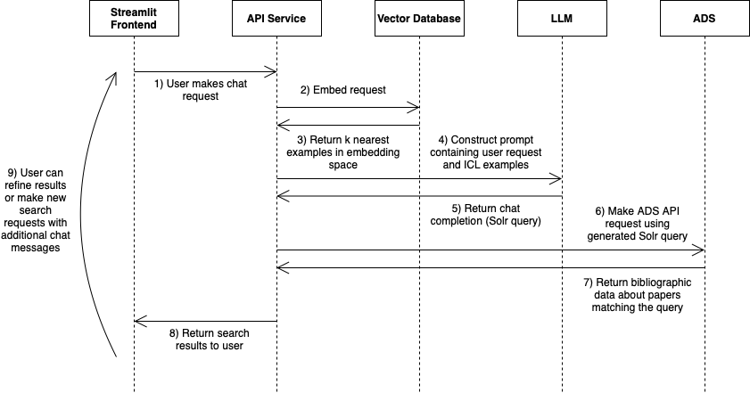

# ADS Chat

An application for searching the NASA ADS with natural language

## ⚙️ System Overview



### Functional Modules

#### Streamlit Frontend
UI where users make and refine requests for papers though chat dialog. Users can also provide feedback on results.

#### API Service
System controller. Exposes an API for the frontend service and the evaluation framework. Fulfills API requests by communicating with and aggregating data from the vector database, the LLM, and ADS.

#### Vector Database
Database for storing and querying embeddings of examples of natural language requests. The Solr query tranlsation of a natural language request is attached as metadata to each vector in the database. May be local (ChromaDB) or remote (Pinecone).

#### LLM
The language model used to perform natural language to Solr query translation. May be local or remote.

#### ADS
The Astrophysics Data System. Executes the Solr queries generated by the LLM.

## 🐳 Repositories
Overview of the component repositories. Each repo contains more details in their own README files.

### chat_api
Dockerized FastAPI service

### chat_streamlit
Dockerized Streamlit application

### chat_compose
Orchestration scripts for running the frontend service and API service on the same docker network.

### evaluation
Framework for evaluating the system. Evaluations may be run instantiating an `Evaluation` from the `eval` module, or through the CLI:
``` bash
python eval.py kelly datasets --temperature=0.2 --icl_type=rag --n_icl=16 --llm="gpt-3.5-turbo-1106" --embedding=HF --kwargs experiment=temperature
```
